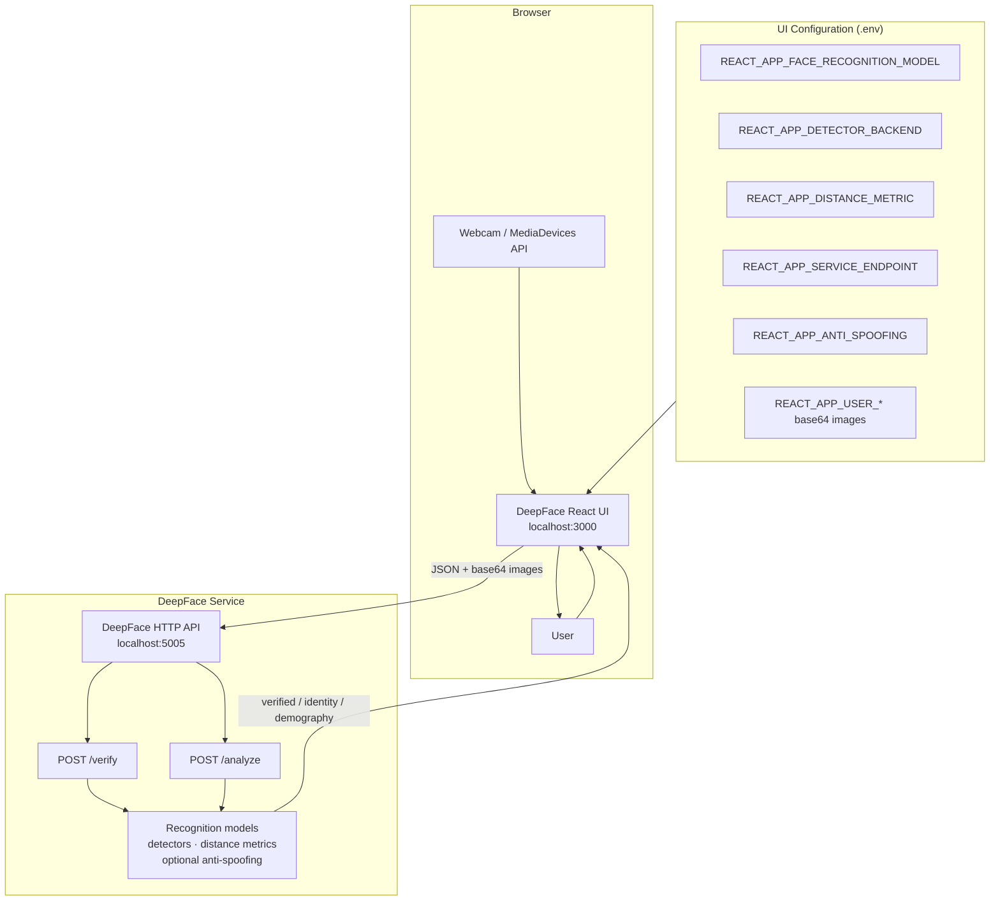
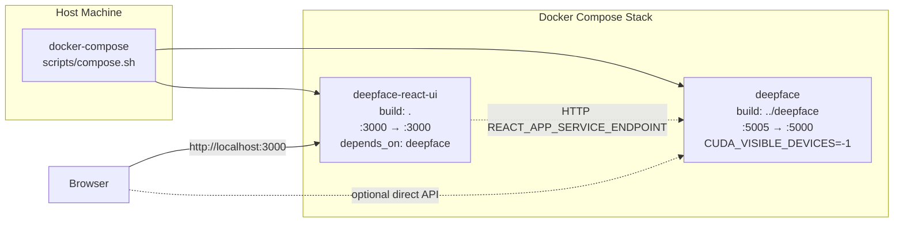
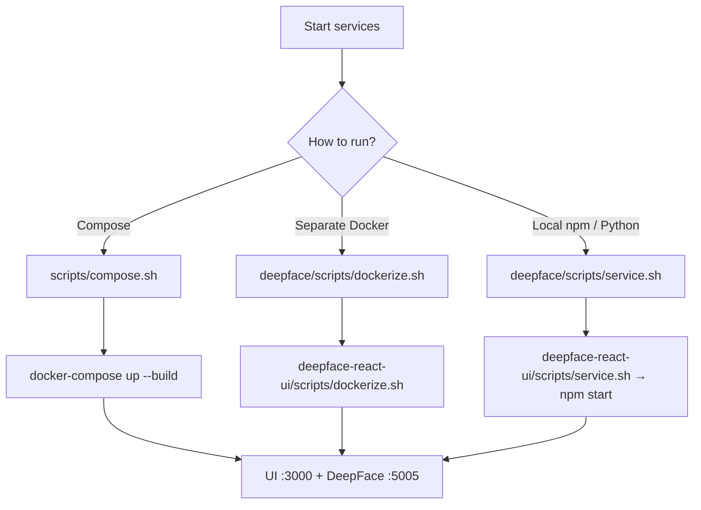
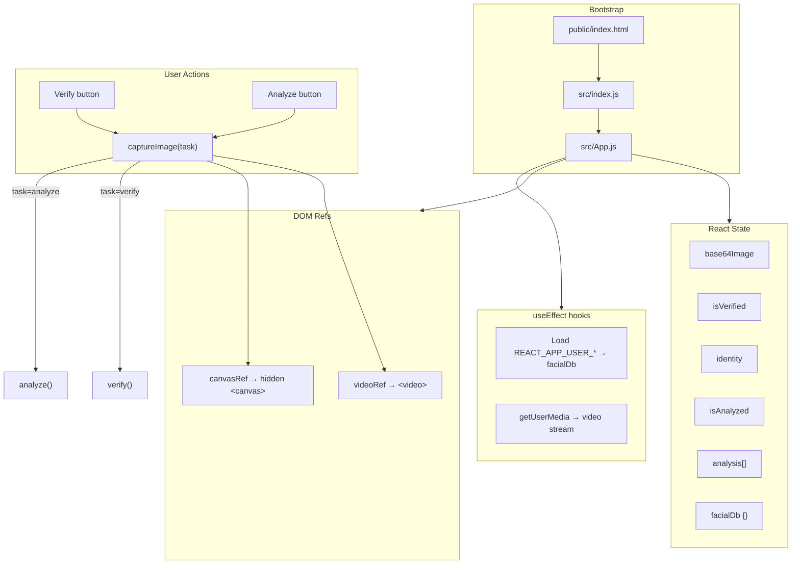
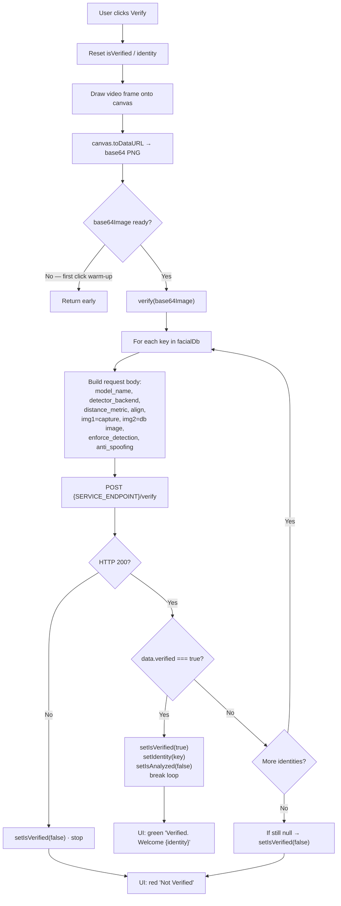
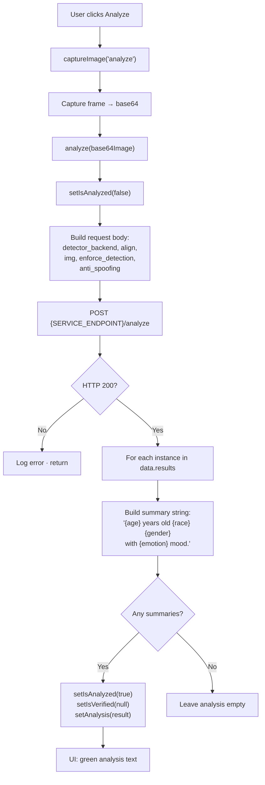
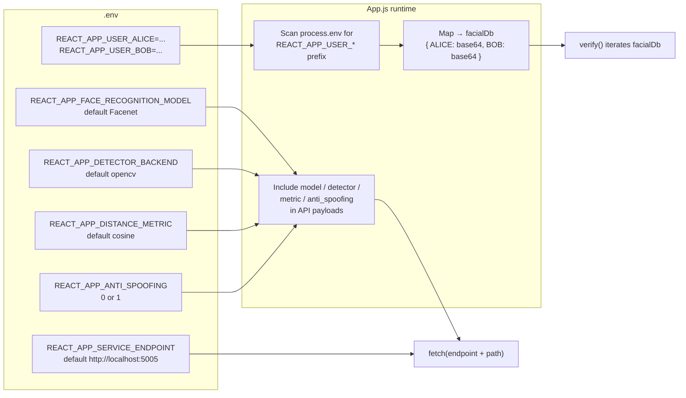
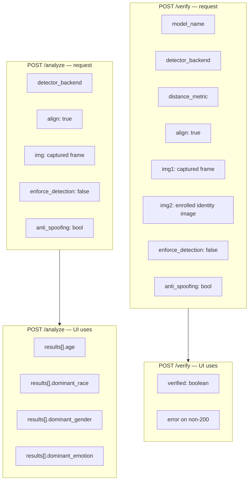

# DeepFace React UI — Architecture

This document describes the current system architecture of **deepface-react-ui** using flowcharts. The UI is a React client that captures webcam frames and calls a separate DeepFace HTTP service for face verification and demography analysis.

---

## 1. System Overview

Two services run together: the React UI (port `3000`) and the DeepFace backend API (port `5005` → container `5000`). The facial identity database is configured in the UI via environment variables, not stored on the backend.



---

## 2. Deployment Architecture

The project can be started as separate processes or via Docker Compose. Compose builds the sibling `deepface` repo and this UI image, then wires ports and dependency order.



### Alternate run paths



---

## 3. Frontend Component Structure

The app is a Create React App project. Almost all application logic lives in a single `App` component: webcam capture, facial DB loading, verification, and analysis.



---

## 4. Face Verification Flow

On **Verify**, the UI captures a frame, then sequentially compares it against each identity in the env-based facial database via `POST /verify` until a match is found or all identities are exhausted.



---

## 5. Facial Attribute Analysis Flow

On **Analyze**, a single captured frame is sent to `POST /analyze`. The UI formats age, race, gender, and emotion results into human-readable summaries.



---

## 6. Configuration & Facial Database

Identity images are embedded at build/runtime as `REACT_APP_USER_<NAME>` env vars (base64 data URLs). Model and detector choices are also env-driven and sent with every API request.



---

## 7. Request / Response Contracts

High-level contracts used by the UI today (fields the client sends and the outcomes it consumes).



---

## 8. End-to-End Sequence

Typical happy-path interaction from page load through verification.

```mermaid
sequenceDiagram
  participant U as User
  participant B as Browser / App.js
  participant Cam as Webcam
  participant Env as .env / process.env
  participant DF as DeepFace API :5005

  U->>B: Open http://localhost:3000
  B->>Env: Read REACT_APP_* config
  B->>Env: Load REACT_APP_USER_* facial DB
  B->>Cam: getUserMedia({ video: true })
  Cam-->>B: MediaStream → &lt;video&gt;

  U->>B: Click Verify
  B->>B: Draw frame to canvas → base64
  loop Each identity in facialDb
    B->>DF: POST /verify {img1, img2, model, ...}
    DF-->>B: { verified: true|false }
    alt Match found
      B-->>U: Verified. Welcome {identity}
    end
  end

  U->>B: Click Analyze
  B->>B: Draw frame to canvas → base64
  B->>DF: POST /analyze {img, detector, ...}
  DF-->>B: { results: [{age, race, gender, emotion}] }
  B-->>U: Demography summary text
```

---

## 9. Repository Layout (architecture-relevant)

| Path | Role |
|------|------|
| `src/App.js` | Webcam UI, facial DB load, `/verify` & `/analyze` clients |
| `src/index.js` | React root bootstrap |
| `.env` / `.env.example` | Service endpoint, models, anti-spoofing, enrolled faces |
| `Dockerfile` | Node 14 Alpine image; `npm start` on `:3000` |
| `docker-compose.yml` | Orchestrates `deepface` + `deepface-react-ui` |
| `scripts/compose.sh` | `docker-compose up --build` |
| `scripts/dockerize.sh` | Run prebuilt UI container |
| `scripts/service.sh` | Local `npm start` |
| Sibling `../deepface` | Backend facial recognition / analysis service |

---

## Summary

| Layer | Technology | Responsibility |
|-------|------------|----------------|
| Presentation | React 18 (CRA) | Webcam preview, capture, verify/analyze UX |
| Config | `REACT_APP_*` env vars | Models, detectors, endpoint, enrolled faces |
| Transport | `fetch` + JSON | Base64 images to DeepFace HTTP API |
| Backend | DeepFace service | Face match, anti-spoofing, demography |
| Ops | Docker / Compose | Package and run UI + API together |
